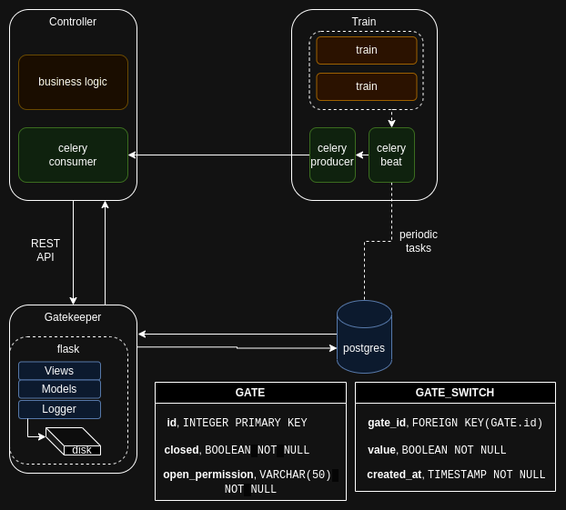

# Micro Train

### Requirements

Project tested with
- docker 25.0.3
- docker-compose 2.24.6

### Usage

`docker compose up`

When the containers are bootstrapped a single (by default) train should start signalling.

The progress of the system can be observed by looking at the produced logs or optionally 
  opening a `flower` dashboard at `localhost:5555`.
In the latter case uncomment flower block in `compose.yml`.

Different number of trains, as well as message intervals, can be set through 
  environment variables given to the `trains` microservice via `.env.trains`.
- `NUMBER_OF_TRAINS`
- `SPEED_REPORT_INTERVAL_SECONDS`
- `STATION_ARRIVAL_INTERVAL_SECONDS`

### Tests

Run static tests:
`scripts/test_static.sh`

Run unit tests:
`scripts/test_unit.sh`
